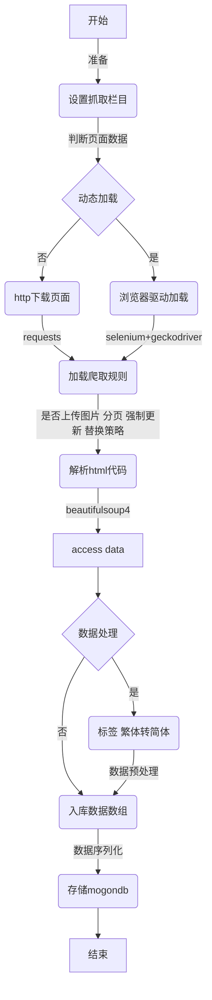

# 资讯情报爬虫项目开发文档
## 1.开发环境搭建
### 1.1开发环境和依赖
+ python版本: python3.x 部属版本为python3.6
+ 使用插件和相关依赖: geckodriver浏览器驱动， 相关依赖参考requirements.txt文件
+ 运行系统: windows和linux环境
+ 集成开发平台: JetBrains PyCharm
### 1.2环境搭建
推荐使用python3.6稳定版本，改版本为项目测试和线上部署版本
#### python linux安装
##### 下载python3.6
    cd /home/download
    wget https://www.python.org/ftp/python/3.6.2/Python-3.6.2.tgz
##### 安装、编译
    tar -xf Python-3.6.2.tgz
    cd Python-3.6.2
    ./configure
    make & make install
##### 建立软连接
    ln -s /usr/local/bin/python3.6  /usr/bin/python3
    ln -s /usr/local/bin/pip3 /usr/bin/pip3
##### 检查python3和pip3是否安装正确
    python3
    pip3
#### python windows安装
windows下面为开发环境，网上教程很多，这里不多加解释。下载python3.6安装包，安装好后设置python和pip的环境变量即可。这里建议下载exe安装文件，可以自动设置python环境变量。
检测windows下面python3和pip3安装成功的方法是打开cmd，输入python和pip有提示信息，代表环境变量设置正确。具体参考网上教程！
## 2.项目部署和运行
### 2.1 开发环境运行
+ 使用PyCharm打开项目，设置好windows下面的python3.6。
+ 打开requirement.txt文件 使用PyCharm安装项目依赖。当然你也可以使用cmd, 在控制台输入pip/pip3 install requirement.txt来安装项目依赖。
+ 修改系统配置文件。打开setting目录，有4个conf文件，文件中主要配置了驱动插件，mongodb, bd-server服务，日志等。系统配置文件根据运行程序主机ipv4来获取，具体参考/util/systemconfg.py程序。程序不能识别主机ip的情况下默认使用setting.conf配置文件。
+ 当整个项目没有报错的情况下，正常运行start.py和sm-start.py即可。到这里本地开发环境算是成功搭建了。
### 2.2 部署环境运行
#### 通过git将项目剪切至部署目录
    git https://*****@gtr.qmcai.com/qmbd/info-crawler.git
 <u>如果git稍未安装,可以通过yum进行安装，或者剪切项目至部署环境，或通过自动部署或者版本控制平台实现代码托管部署。</u>
#### 使用virtualenv创建python虚拟环境
#####  通过pip安装virtualenv插件
```
pip install virtualenv 或 pip3 install virtualenv
```
<u>关于pip和pip3使用具体参考自己环境安装方式和软连接设置，这里必须使用python3.x的pip插件,也就是pip3</u>
#####  项目创建虚拟环境
```
ln -s /usr/local/bin/virtualenv  /usr/bin/virtualenv
virtualenv venv
virtualenv -p /usr/bin/python3.6 venv
```
<u>该操作必须切换至项目根目录下将进行, -p参数是系统python3.6解释器程序路径</u>
<u>virtualenv虚拟环境使用请参考下面的链接教程: </u> [virtualenv使用指南](https://www.cnblogs.com/technologylife/p/6635631.html)
#####  浏览器驱动geckodriver使用
项目目录driver中已经下载好了，windows环境下geckodriver版本并无严格要求，关于linux版本中geckodriver根据linux系统环境而定。
输入以下命令可查看驱动版本已经检测geckodriver是否能正常运行。
```
./geckodriver -v
```
如果不能运行需要根据系统切换驱动版本或者更新linux相关组件。
geckodriver驱动下载网址: [geckodriver下载](https://github.com/mozilla/geckodriver/releases)
#####  安装项目依赖
```
source venv/bin/activate
pip3 install -r requirements.txt
```
<u>该操作必须激活虚拟环境 不然项目依赖会被安装到系统python3.x公共环境package的目录中</u>
#####  项目启动和脚本定时任务设置
项目运行脚本定时任务，本人先后尝试过2种方式。分别为通过python3程序控制已经通过linux系统crontab进行控制。通过程序控制有一定的缺陷，在脚本过多，http访问频率过高的情况下可能会出现线程假死状态。即程序运行未报错，但是程序却不再继续执行。该方式慎用。
+ 程序控制：程序启动的方式比较简单，先激活虚拟环境，然后使用python命令运行相关需求对应的爬虫脚本就行了。
+ crontab控制:  通过编辑sh启动脚本，并在crontab中设置定时任务定时启动sh脚本来执行程序。下面是圈子资讯和球客情报，卖料资讯对应的cron表达式:
```
30 * * * * sh /home/xldevs/info-crawler/info-crawler.git/start.sh
0 */2 * * * sh /home/xldevs/info-crawler/sminfo/sm-start.sh
```
<u>crontab使用和cron表达式编辑规则具体参考网上资料。</u>
## 3.项目结构和数据存储
### 3.1 项目需求列表
 项目截止至开发文档编辑时间为止，共开发了3个爬虫需求，后来又陆续新增了多个爬虫脚本。对应关系如下:
+ burstcrawler ------ 球客情报资讯（包含901,彩客，雷速 等三大网站的爬取规则）
+ crawler ------ 卖料17个网址的爬虫，目前内创平台使用该数据
+ realtimeinfo ------ 圈子8个网址的资讯
### 3.2 数据库爬取和存储流程

<u>核心代码请参考crawer.py /task /util下相关程序</u>

